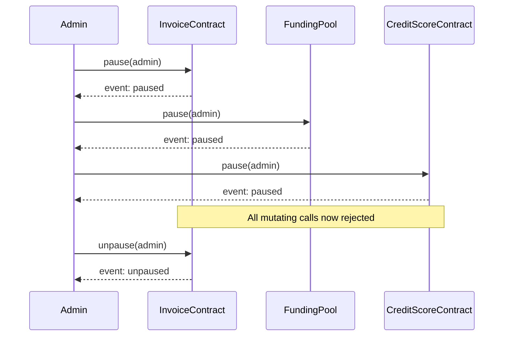

# Design Document: Circuit Breaker

## Overview

The circuit breaker pattern adds a `Paused` boolean flag to each of the three Soroban contracts (InvoiceContract, FundingPool, CreditScoreContract). When an admin activates the breaker, every state-changing entry point checks the flag and panics with `"contract is paused"` before doing any work. Read-only views are unaffected. The admin can restore normal operation by calling `unpause`.

## Architecture

Each contract is self-contained; there is no cross-contract pause propagation. An admin must call `pause` on each contract individually. This keeps the blast radius of a bug in the pause mechanism itself minimal and avoids adding cross-contract call complexity.



## Components and Interfaces

### Shared pattern (applied identically to all three contracts)

New `DataKey` variant added to each contract's enum:
```rust
Paused,
```

New public functions added to each contract:
```rust
pub fn pause(env: Env, admin: Address)
pub fn unpause(env: Env, admin: Address)
pub fn is_paused(env: Env) -> bool
```

Internal guard macro / helper called at the top of every mutating function:
```rust
fn require_not_paused(env: &Env) {
    if env.storage().instance().get(&DataKey::Paused).unwrap_or(false) {
        panic!("contract is paused");
    }
}
```

### InvoiceContract mutations guarded
`create_invoice`, `verify_invoice`, `resolve_dispute`, `mark_funded`, `mark_paid`, `mark_defaulted`, `cleanup_invoice`, `set_oracle`, `set_pool`

### FundingPool mutations guarded
`deposit`, `withdraw`, `init_co_funding`, `commit_to_invoice`, `repay_invoice`, `add_token`, `remove_token`, `set_yield`, `cleanup_funded_invoice`

### CreditScoreContract mutations guarded
`record_payment`, `record_default`, `set_invoice_contract`, `set_pool_contract`

## Data Models

No new structs are required. A single boolean is stored under the `Paused` key in each contract's instance storage:

| Contract | Storage key | Type | Default |
|---|---|---|---|
| InvoiceContract | `DataKey::Paused` | `bool` | `false` |
| FundingPool | `DataKey::Paused` | `bool` | `false` |
| CreditScoreContract | `DataKey::Paused` | `bool` | `false` |

The flag lives in instance storage (same as `Admin`, `Config`, etc.) so it is always available without a persistent-storage lookup and benefits from the existing instance TTL bump.

## Correctness Properties

*A property is a characteristic or behavior that should hold true across all valid executions of a system-essentially, a formal statement about what the system should do. Properties serve as the bridge between human-readable specifications and machine-verifiable correctness guarantees.*

Property 1: Pause blocks all mutating operations
*For any* contract in the paused state, every state-changing function call SHALL panic with "contract is paused".
**Validates: Requirements 1.3, 2.3, 3.3**

Property 2: Read-only operations are unaffected by pause
*For any* contract in the paused state, every read-only (view) function SHALL return the same result as it would in the unpaused state.
**Validates: Requirements 1.4, 2.4, 3.4**

Property 3: Pause then unpause restores full operation (round-trip)
*For any* contract, calling `pause` followed by `unpause` SHALL restore the contract to a fully operational state where all previously-allowed mutating calls succeed again.
**Validates: Requirements 1.1, 1.2, 2.1, 2.2, 3.1, 3.2**

Property 4: Only admin can toggle the circuit breaker
*For any* address that is not the stored admin, calling `pause` or `unpause` SHALL panic with "unauthorized".
**Validates: Requirements 1.5, 2.5, 3.5**

Property 5: is_paused reflects current state
*For any* contract, `is_paused()` SHALL return `true` immediately after `pause` and `false` immediately after `unpause` (and `false` after initialization).
**Validates: Requirements 4.1, 4.2, 4.3, 4.4**

## Error Handling

- Calling a mutating function while paused → `panic!("contract is paused")`
- Calling `pause` or `unpause` from a non-admin address → `panic!("unauthorized")`
- Calling `pause` on an already-paused contract is idempotent (no error, flag stays `true`).
- Calling `unpause` on an already-unpaused contract is idempotent (no error, flag stays `false`).

## Testing Strategy

### Unit tests (example-based)
Each contract gets a dedicated test module section covering:
- `pause` sets the flag and emits the event.
- `unpause` clears the flag and emits the event.
- Each mutating function panics with `"contract is paused"` when called while paused.
- Each view function succeeds while paused.
- Non-admin `pause`/`unpause` panics with `"unauthorized"`.
- `is_paused` returns correct values before, during, and after pause.

### Property-based tests
The property-based testing library used is **`proptest`** (crate `proptest = "1"`), which integrates with Rust's standard test runner and supports `no_std`-compatible usage via `proptest` strategies.

Each property-based test MUST be tagged with:
`// **Feature: circuit-breaker, Property {N}: {property_text}**`

Each property-based test MUST run a minimum of 100 iterations (proptest default is 256).

- **Property 1** – Generate random valid inputs for each mutating function; assert all panic with `"contract is paused"` when the contract is paused.
- **Property 2** – Generate random valid inputs for each view function; assert results are identical whether the contract is paused or not.
- **Property 3** – For each mutating function, pause then unpause, then assert the call succeeds.
- **Property 4** – Generate random non-admin addresses; assert `pause`/`unpause` always panics with `"unauthorized"`.
- **Property 5** – Assert `is_paused` tracks the toggle correctly across arbitrary sequences of pause/unpause.
