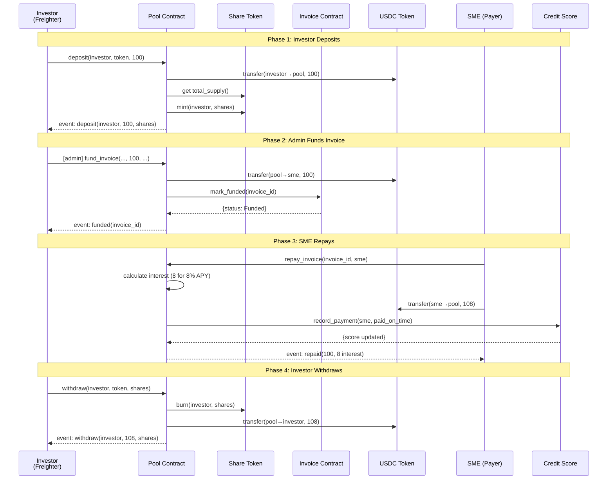
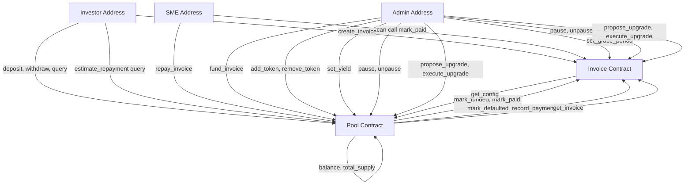
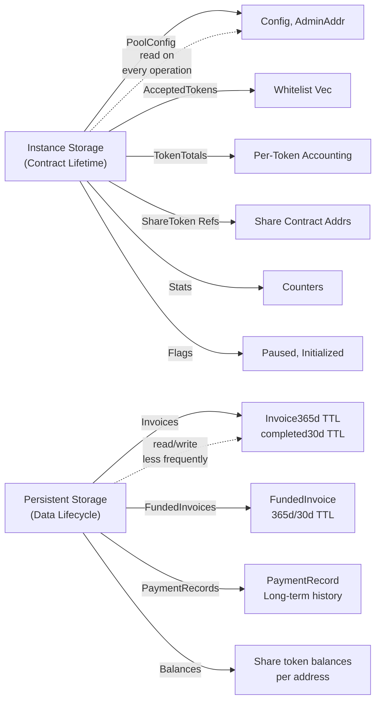
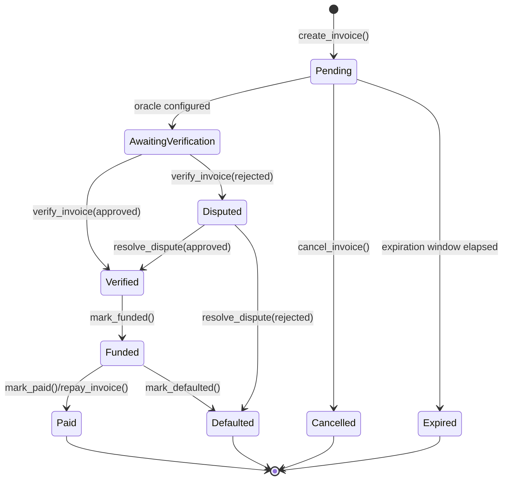
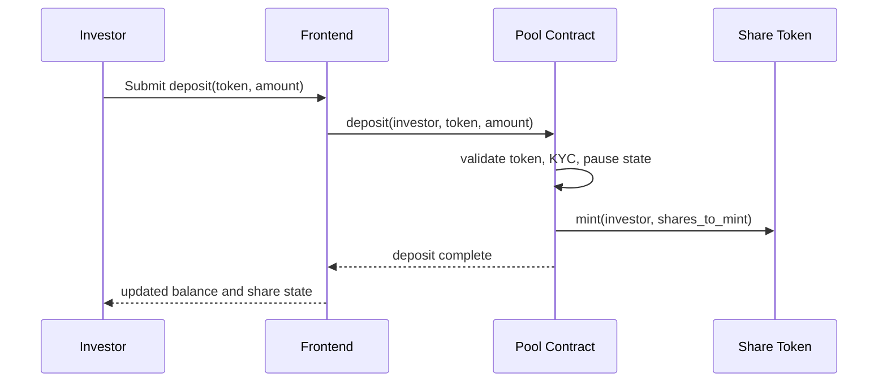
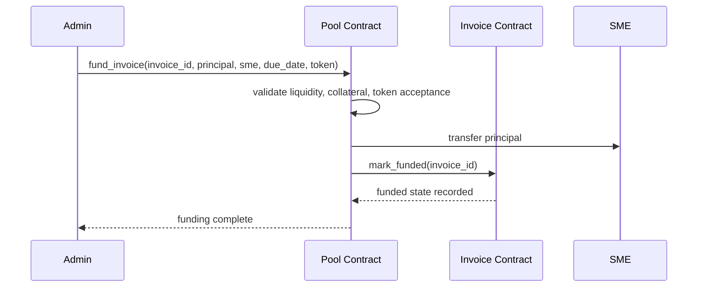
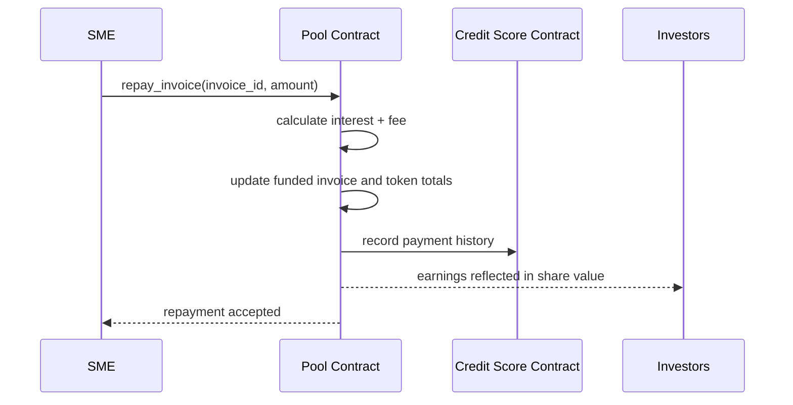
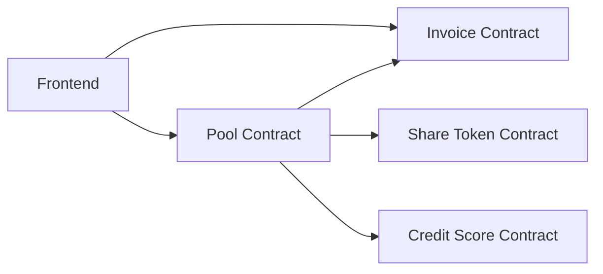

# Technical Architecture Reference

## Overview

Astera is a Real World Assets (RWA) financing platform on Stellar blockchain that enables Small and Medium Enterprises (SMEs) to tokenize unpaid invoices and connect with community investors through Soroban smart contracts. The system comprises four coordinated contracts: an Invoice Contract managing the lifecycle of tokenized invoices, a Pool Contract handling investor deposits and liquidity, a Credit Score Contract building on-chain credit history, and a Share Token Contract for managing pool share distribution.

The platform operates on the core principle that invoices become RWA tokens, a liquidity pool funded by investors provides capital to SMEs, and automatic repayment + yield distribution closes the loop between all parties.

---

## Technology Stack

### Framework & Language
- **Smart Contract Framework**: Soroban SDK 22.0.0 (Stellar's native Rust-based smart contract environment)
- **Language**: Rust 1.75.0+ (no_std compatible)
- **Compilation Target**: `wasm32-unknown-unknown`

### Smart Contracts
- **Invoice Contract** (`contracts/invoice/src/lib.rs`): Written in Rust, compiles to WebAssembly
- **Pool Contract** (`contracts/pool/src/lib.rs`): Written in Rust, compiles to WebAssembly
- **Credit Score Contract** (`contracts/credit_score/src/lib.rs`): Written in Rust, compiles to WebAssembly
- **Share Token Contract** (`contracts/share/src/lib.rs`): Written in Rust, compiles to WebAssembly

### Frontend
- **Framework**: Next.js 15 with TypeScript
- **Wallet Integration**: Freighter Browser Extension + Stellar JavaScript SDK
- **State Management**: Zustand (global store)
- **Styling**: Tailwind CSS
- **Build Tool**: npm/Node.js 20+

### Deployment & CI/CD
- **Container Orchestration**: Docker Compose (local development)
- **CI Pipeline**: GitHub Actions (`.github/workflows/ci.yml`)
- **Stellar Network Access**:
  - **Testnet**: `https://soroban-testnet.stellar.org` (RPC), `https://horizon-testnet.stellar.org` (Horizon)
  - **Mainnet**: `https://soroban-mainnet.stellar.org` (RPC), `https://horizon.stellar.org` (Horizon)

### Key Dependencies
- `soroban-sdk = 22.0.0`
- Rust edition: 2021
- Release profile optimized for WASM size: `opt-level = "z"`, `lto = true`, `codegen-units = 1`

---

## Repository Structure

```
contracts/
├── invoice/
│   ├── Cargo.toml           # Invoice contract crate
│   ├── src/lib.rs           # Invoice contract implementation (1468 lines)
│   ├── README.md            # Invoice-specific documentation
│   └── tests/fuzz_tests.rs  # Fuzz tests
├── pool/
│   ├── Cargo.toml           # Pool contract crate
│   ├── src/lib.rs           # Pool contract implementation (957 lines)
│   ├── README.md            # Pool-specific documentation
│   └── tests/fuzz_tests.rs  # Fuzz tests
├── credit_score/
│   ├── Cargo.toml           # Credit score contract crate
│   └── src/lib.rs           # Credit score contract implementation (1399 lines)
├── share/
│   ├── Cargo.toml           # Share token contract crate
│   └── src/lib.rs           # Share token contract implementation (simple share token)
├── tests/
│   └── integration_tests.rs  # Cross-contract integration tests (373 lines)
└── Dockerfile               # Contract build environment

frontend/
├── app/                      # Next.js App Router pages
│   ├── page.tsx             # Home page
│   ├── layout.tsx           # Root layout
│   ├── invoice/[id]/        # Invoice detail page
│   ├── invest/              # Investor deposit interface
│   ├── dashboard/           # User dashboard
│   ├── admin/               # Admin controls
│   └── api/                 # Next.js API routes
├── components/              # Reusable React components
│   ├── WalletConnect.tsx    # Freighter integration
│   ├── APYCalculator.tsx    # Yield calculation UI
│   ├── CreditScore.tsx      # Credit score display
│   └── [other components]
├── lib/                      # Shared utilities
│   ├── contracts.ts         # Contract interaction builders
│   ├── stellar.ts           # Stellar SDK helpers
│   ├── store.ts             # Zustand store
│   ├── types.ts             # TypeScript type definitions
│   └── [other utilities]
├── __tests__/               # Jest tests
├── next.config.mjs          # Next.js configuration
├── tailwind.config.ts       # Tailwind CSS configuration
├── tsconfig.json            # TypeScript configuration
├── jest.config.ts           # Jest test configuration
├── package.json             # npm dependencies
└── Dockerfile               # Frontend build environment

docs/
├── ARCHITECTURE.md          # This file - technical architecture reference
├── API_REFERENCE.md         # Complete contract API documentation (1812 lines)
├── deployment.md            # Step-by-step testnet deployment guide (643 lines)
├── mainnet-deployment.md    # Mainnet deployment guide with security checklist
├── gas-optimizations.md     # Performance tuning documentation
├── mainnet-checklist.md     # Pre-production verification checklist
├── adr/                     # Architecture Decision Records
│   ├── 0001-simple-interest-calculation.md
│   ├── 0002-default-yield-rate.md
│   ├── 0003-no-pool-share-tokenization.md
│   ├── 0004-storage-architecture.md
│   └── README.md
└── guides/                  # User and operator guides
    ├── investor-guide.md    # Guide for LPs
    ├── sme-guide.md        # Guide for SME users
    ├── faq.md
    ├── glossary.md
    └── troubleshooting.md

.github/
├── workflows/ci.yml         # GitHub Actions CI/CD pipeline
└── ISSUE_TEMPLATE/          # Issue templates

Cargo.toml                   # Workspace configuration
CONTRIBUTING.md             # Contribution guidelines
SECURITY.md                 # Security policy and audit information
README.md                   # Project overview
docker-compose.yml          # Local development environment orchestration

target/                     # Build artifacts (compiled WASM, dependencies)
```

---

## Contract Architecture

Astera's smart contract system is composed of four interdependent contracts, each managing a specific domain:

### 1. Invoice Contract (`contracts/invoice/src/lib.rs`)

**Purpose**: Manages the complete lifecycle of tokenized invoices from creation through payment or default.

**Responsibilities**:
- Create new invoice tokens with amount, debtor, and due date
- Track invoice state transitions (Pending → Funded → Paid or Defaulted)
- Maintain an on-chain ledger of all invoices
- Enforce a grace period before marking invoices as defaulted
- Support optional oracle-based verification of invoice authenticity
- Provide metadata compatible with Stellar Asset Protocol (SEP-0041)

**Key State Variables** (stored via `DataKey` enum):
- `Invoice(u64)` → Full invoice record: owner, debtor, amount, due_date, status, timestamps, pool reference, oracle verification flags
- `InvoiceCount` → Sequential counter for invoice IDs (current max ID)
- `Admin` → Address of admin who can pause/unpause, set oracle, set grace period
- `Pool` → Address of authorized pool contract
- `Oracle` → Optional oracle address for invoice verification
- `StorageStats` → Counters for total, active, and cleaned invoices
- `Paused` → Circuit breaker flag
- `GracePeriodDays` → Number of days (default 7) before marked-as-defaulted invoices can trigger
- `DailyInvoiceCount(Address)` → Rate limiting counter per creator
- `DailyInvoiceResetTime(Address)` → Timestamp for rate limit reset
- `DailyInvoiceLimit` → Admin-configurable per-address daily invoice cap

**Invoice Status Enum**:
- `Pending` — Created, awaiting optional oracle verification
- `AwaitingVerification` — Submitted to oracle (if oracle is configured)
- `Verified` — Oracle approved; ready for funding
- `Disputed` — Oracle rejected; awaiting admin review
- `Funded` — Fully funded by pool; funds disbursed to SME
- `Paid` — Invoice repaid in full by SME
- `Defaulted` — Missed due date + grace period; investor loss

**Storage Architecture** (from ADR-0004):
- Instance storage: Admin, Pool, Oracle, Initialized, Paused, GracePeriodDays, counters, pause state
- Persistent storage: Individual `Invoice(id)` records with TTL management
  - Active invoices: 365 days TTL
  - Completed invoices (Paid/Defaulted): 30 days TTL
  - Cleanup available after completion to reclaim storage rent

**Events Emitted** (symbol_short! format):
- `created` (id, owner, amount) — New invoice created
- `funded` (id) — Invoice marked funded by pool
- `paid` (id) — Invoice repaid
- `default` (id) — Invoice defaulted (after grace period)
- `verified` (id) — Oracle verification passed
- `disputed` (id) — Oracle verification rejected
- `resolved` (id) — Dispute resolved by admin
- `cleaned` (id) — Completed invoice removed from storage
- `paused` (admin) — Contract paused
- `unpaused` (admin) — Contract unpaused
- `upgraded` (admin, timestamp) — Contract code upgraded

**Rate Limiting**: Defaults to 10 invoices per address per day, but the admin can now tune that cap with `set_daily_invoice_limit(limit)`. Counters still reset on a rolling 24-hour window based on ledger timestamp.

**Upgrade Mechanism**: Implements `propose_upgrade(admin, wasm_hash)` + `execute_upgrade(admin)` with 24-hour timelock

---

### 2. Pool Contract (`contracts/pool/src/lib.rs`)

**Purpose**: Manages investor capital, token whitelisting, invoice funding, and yield distribution.

**Responsibilities**:
- Accept multiple stablecoin tokens (USDC, EURC, etc.) through admin whitelist
- Manage investor deposits and withdrawals via share token minting/burning
- Fund invoices from available liquidity and track deployment
- Calculate and distribute interest/yield to investors
- Track per-token accounting and per-investor positions
- Support both simple and compound interest calculations
- Enable factoring fees on funded invoices

**Key State Variables** (stored via `DataKey` enum):
- `Config` → PoolConfig: admin, invoice_contract, yield_bps, factoring_fee_bps, compound_interest flag
- `AcceptedTokens` → Vec<Address> of whitelisted stablecoin contract addresses
- `ExchangeRate(Address)` → Current admin-set USD-normalized rate per accepted token
- `ExchangeRateBounds(Address)` → Min/max guardrails that exchange-rate updates must respect
- `TokenTotals(Address)` → Per-token aggregates: pool_value, total_deployed, total_paid_out, total_fee_revenue
- `FundedInvoice(u64)` → Record of funded invoice: sme, token, principal, funded_at, factoring_fee, due_date, repaid flag
- `ShareToken(Address)` → Address of share token contract for each accepted token
- `Initialized` → Initialization flag
- `StorageStats` → Counters for funded/active/cleaned invoices
- `Paused` → Circuit breaker flag

**PoolConfig Struct**:
- `invoice_contract: Address` — Authorized Invoice Contract
- `admin: Address` — Admin for privileged operations
- `yield_bps: u32` — Annual percentage yield in basis points (default 800 = 8%, max 5000 = 50%)
- `factoring_fee_bps: u32` — Platform fee in basis points (default 0)
- `compound_interest: bool` — Simple (false) vs compound (true) interest calculation

**PoolTokenTotals Struct** (per token):
- `pool_value: i128` — Total liquidity available or deployed
- `total_deployed: i128` — Amount locked in active invoices
- `total_paid_out: i128` — Total repayment received (principal + interest)
- `total_fee_revenue: i128` — Accumulated platform fees

**FundedInvoice Struct**:
- `invoice_id: u64` — Reference to Invoice Contract
- `sme: Address` — SME receiving funds
- `token: Address` — Stablecoin used for this invoice
- `principal: i128` — Funding amount
- `funded_at: u64` — Timestamp when fully funded
- `factoring_fee: i128` — Platform fee locked at funding time
- `due_date: u64` — Invoice due date
- `repaid: bool` — Whether fully repaid

**Operations**:
- `deposit(investor, token, amount)` → Investor deposits stablecoin, receives share tokens (pro-rata)
- `withdraw(investor, token, shares)` — Investor burns share tokens, receives stablecoins (if liquidity available)
- `fund_invoice(admin, invoice_id, principal, sme, due_date, token)` — Admin deploys liquidity to invoice
- `repay_invoice(invoice_id, payer)` — SME repays principal + interest, interest distributed to investors
- `estimate_repayment(invoice_id)` → Returns total due (principal + interest accrued)

**Interest Calculation** (ADR-0001):
- **Simple Interest**: `interest = principal × (yield_bps / 10000) × (elapsed_seconds / 31536000)`
- **Compound Interest**: Applied daily, calculated with iteration over day boundaries
- Default: 8% APY simple interest (800 basis points)
- Implementation detail: the current contract uses checked intermediate arithmetic so oversized principals or durations fail predictably instead of overflowing silently.

**Exchange Rate Validation**:
- `set_rate_bounds(token, min_bps, max_bps)` defines the allowed update range for each accepted token.
- `set_exchange_rate(token, rate_bps)` now rejects values outside those bounds.
- A live oracle integration is still planned as a future enhancement rather than an active dependency in the current contract.

**Storage Architecture** (ADR-0004):
- Instance storage: Config, AcceptedTokens, TokenTotals, ShareToken references, stats
- Persistent storage: FundedInvoice records with TTL management
  - Active invoices: 365 days TTL
  - Completed invoices: 30 days TTL
  - Cleanup available after repayment

**Token Management**:
- Admin whitelist controls which stablecoins are accepted
- Each token has separate accounting, separate share token contract
- Tokens cannot be removed if they have non-zero balances

**Events Emitted**:
- `deposited` (investor, amount, shares) — Investor deposit
- `withdrawn` (investor, amount, shares) — Investor withdrawal
- `funded` (invoice_id, sme, principal) — Invoice funded
- `repaid` (invoice_id, principal, interest) — Invoice repaid
- `add_token` (admin, token) — Token whitelisted
- `rm_token` (admin, token) — Token removed from whitelist
- `set_yield` (admin, yield_bps) — Yield rate changed
- `set_comp` (admin, compound) — Interest type changed
- `upgraded` (admin, timestamp) — Contract code upgraded

**Upgrade Mechanism**: Same as Invoice Contract (24-hour timelock)

---

### 3. Credit Score Contract (`contracts/credit_score/src/lib.rs`)

**Purpose**: Build persistent on-chain credit history for each SME based on payment behavior.

**Responsibilities**:
- Record payment outcomes (on-time, late, defaulted) for each invoice
- Calculate credit score based on payment history
- Track aggregated metrics: total volume, average payment days
- Maintain historical payment records
- Support score versioning for future algorithm updates

**Key State Variables**:
- `CreditScore(Address)` → Credit score data for each SME
- `PaymentHistory(Address)` → Count of payment records
- `PaymentRecordIdx(Address, u32)` → Individual payment records with index
- `InvoiceProcessed(u64)` → Flag tracking which invoices have been processed
- `Admin` → Admin address
- `InvoiceContract` → Reference to Invoice Contract
- `PoolContract` → Reference to Pool Contract
- `ScoreVersion` → Algorithm version for migrations
- `Paused` → Circuit breaker flag

**CreditScoreData Struct**:
- `sme: Address` — SME address
- `score: u32` — Credit score (200-850 range, 500 base)
- `total_invoices: u32` — Cumulative count
- `paid_on_time: u32` — Count of on-time repayments
- `paid_late: u32` — Count of late repayments (within threshold)
- `defaulted: u32` — Count of defaults
- `total_volume: i128` — Sum of all invoice amounts
- `average_payment_days: i64` — Running average days vs due date
- `last_updated: u64` — Timestamp of last update
- `score_version: u32` — Algorithm version

**PaymentRecord Struct**:
- `invoice_id: u64` — Reference to invoice
- `sme: Address` — SME address
- `amount: i128` — Invoice amount
- `due_date: u64` — Invoice due date
- `paid_at: u64` — Actual payment timestamp
- `status: PaymentStatus` — On-time, late, or defaulted
- `days_late: i64` — Signed days vs due date (negative = early)

**Score Calculation**:
- Base score: 500
- On-time payment: +30 points each (max ~6 invoices)
- Late payment: +15 points each
- Default: -50 points each
- Volume bonus: +5 to +25 points based on total volume
- Timing bonus/penalty: Up to ±20 points based on average payment days
- Range clamped: 200 (minimum) to 850 (maximum)

**Late Threshold**: 7 days after due date (LATE_PAYMENT_THRESHOLD_SECS = 604800 seconds)

**Integration Point**: Called from pool contract when invoices are repaid via `record_payment()` method

**Events Emitted**:
- `recorded` (sme, score, status) — Payment recorded
- `paused/unpaused` — Circuit breaker events

---

### 4. Share Token Contract (`contracts/share/src/lib.rs`)

**Purpose**: Manages pool share token distribution for each accepted stablecoin.

**Responsibilities**:
- Mint shares when investors deposit
- Burn shares when investors withdraw
- Track total supply and per-address balances
- Enforce authorization for mint/burn operations (only pool contract can call)

**Key State Variables**:
- `Admin` → Admin address (the pool contract)
- `Name` → Token name (e.g., "Astera USDC Pool Shares")
- `Symbol` → Token symbol (e.g., "aUSDC")
- `Decimals` → Always 7 (matches Stellar USDC)
- `Balance(Address)` → Per-address balance
- `TotalSupply` → Total shares outstanding

**Share Token Economics**:
- 1 share = pro-rata claim on pool
- When deposit: `shares_to_mint = (amount × total_shares) / pool_value`
- When withdraw: `amount_to_return = (shares × pool_value) / total_shares`
- On first deposit: shares = amount (1:1 initial ratio)

---

## Contract Interactions

### Cross-Contract Call Graph

```
Frontend (Freighter Wallet)
    ├─→ Invoice Contract
    │    ├─→ create_invoice(owner, debtor, amount, due_date)
    │    ├─→ get_invoice(id)
    │    └─→ get_metadata(id)  [SEP-0041 compliant]
    │
    ├─→ Pool Contract
    │    ├─→ deposit(investor, token, amount)
    │    │    └─→ Transfer stablecoin token
    │    │    └─→ Share Token.mint(investor, shares)
    │    ├─→ withdraw(investor, token, shares)
    │    │    └─→ Share Token.burn(investor, shares)
    │    │    └─→ Transfer stablecoin token
    │    └─→ repay_invoice(invoice_id, payer)
    │         └─→ Transfer stablecoin token
    │         └─→ Credit Score.record_payment()
    │
    ├─→ Credit Score Contract
    │    └─→ get_credit_score(sme)
    │
    └─→ Stablecoin Token Contract (Stellar native)
         └─→ Transfer, balance queries
```

### Major Transaction Flows

#### Flow 1: Investor Deposits into Pool

1. **Caller**: Investor (authenticated)
2. **Entry Point**: `Pool.deposit(investor, token, amount)`
3. **Sequence**:
   - Validate amount > 0
   - Validate token in whitelist
   - Transfer `amount` from investor → pool contract
   - Read current `TokenTotals(token)` and `ShareToken(token)`
   - Calculate shares: if first deposit, shares=amount; else shares=(amount×total_shares)/pool_value
   - Update `TokenTotals[pool_value] += amount`
   - Call `ShareToken.mint(investor, shares)`
   - Emit `deposit` event
4. **Outcome**: Investor now owns pool shares, earning yield on any funded invoices
5. **Failure Cases**:
   - Insufficient funds → transfer fails
   - Unauthorized token → panic("token not accepted")
   - Negative amount → panic("amount must be positive")

**Storage State Post-Transaction**:
- `TokenTotals[token].pool_value` increased by amount
- `ShareToken.balance[investor]` increased by shares
- `ShareToken.total_supply` increased by shares

---

#### Flow 2: Admin Funds an Invoice

1. **Caller**: Admin (authenticated)
2. **Entry Point**: `Pool.fund_invoice(admin, invoice_id, principal, sme, due_date, token)`
3. **Sequence**:
   - Validate admin authorization
   - Validate token is whitelisted
   - Validate principal > 0
   - Validate sufficient available liquidity (available = pool_value - total_deployed)
   - Create `FundedInvoice` record: principal, sme, token, due_date, funded_at=0, repaid=false
   - Store in persistent storage with TTL = 365 days
   - Update `TokenTotals[token]`: total_deployed += principal
   - Transfer `principal` from pool → sme (via stablecoin token contract)
   - Call `Invoice.mark_funded(invoice_id, pool_address)` on Invoice Contract
   - Emit `funded` event
4. **Outcome**: SME received funds, invoice status transitions to Funded, investor capital is now deployed
5. **Failure Cases**:
   - Insufficient liquidity → panic("insufficient available liquidity")
   - Unauthorized caller → panic("unauthorized")
   - Invoice already funded → panic("invoice already funded")

**Storage State Post-Transaction**:
- `TokenTotals[token].total_deployed` increased by principal
- `TokenTotals[token].pool_value` decreased by principal (net: available liquidity reduced)
- `FundedInvoice[invoice_id]` stored
- `Invoice[invoice_id].status = Funded`, `funded_at = timestamp`

---

#### Flow 3: SME Repays Invoice

1. **Caller**: SME/payer (authenticated)
2. **Entry Point**: `Pool.repay_invoice(invoice_id, payer)`
3. **Sequence**:
   - Retrieve `FundedInvoice[invoice_id]`
   - Validate not already repaid
   - Calculate interest: `interest = principal × (yield_bps / 10000) × (elapsed_seconds / 31536000)`
   - Calculate total due: `total_due = principal + interest + factoring_fee`
   - Transfer `total_due` from payer → pool contract
   - Update `FundedInvoice[invoice_id].repaid = true`
   - Update `TokenTotals[token]`:
     - `total_deployed -= principal` (capital released)
     - `pool_value += interest` (yield added to pool)
     - `total_fee_revenue += factoring_fee`
   - Call `Credit Score.record_payment(invoice_id, sme, amount, due_date, paid_at)` to update credit score
   - Move `FundedInvoice` to completed TTL (30 days) for eventual cleanup
   - Emit `repaid` event with principal and interest earned
4. **Outcome**: Investor capital returned plus interest; SME's credit score updated
5. **Failure Cases**:
   - Invoice already repaid → panic("already repaid")
   - Insufficient payment amount → transfer fails
   - Not found → panic("invoice not found")

**Storage State Post-Transaction**:
- `TokenTotals[token].total_deployed` decreased by principal
- `TokenTotals[token].pool_value` increased by interest
- `TokenTotals[token].total_paid_out` increased by total_due
- `FundedInvoice[invoice_id].repaid = true`
- `CreditScore[sme]` updated with new payment record
- Investor positions automatically updated (investors earn yield proportionally to shares)

---

#### Flow 4: Investor Withdraws from Pool

1. **Caller**: Investor (authenticated)
2. **Entry Point**: `Pool.withdraw(investor, token, shares)`
3. **Sequence**:
   - Validate shares > 0
   - Validate token is whitelisted
   - Call `ShareToken.balance(investor)` → must be ≥ shares requested
   - Call `ShareToken.total_supply()` → calculate withdrawal amount
   - Calculate amount: `amount = (shares × pool_value) / total_shares`
   - Validate sufficient available liquidity: `available = pool_value - total_deployed`
   - If insufficient, panic("insufficient available liquidity")
   - Call `ShareToken.burn(investor, shares)` to remove shares
   - Update `TokenTotals[token].pool_value -= amount`
   - Transfer `amount` from pool → investor
   - Emit `withdraw` event
4. **Outcome**: Investor receives cash (principal + earned interest pro-rata), reduces pool size
5. **Failure Cases**:
   - Insufficient shares → panic("insufficient shares")
   - Insufficient liquidity → panic("insufficient available liquidity")
   - Invalid token → panic("token not accepted")

**Storage State Post-Transaction**:
- `TokenTotals[token].pool_value` decreased by amount
- `ShareToken.balance[investor]` decreased by shares
- `ShareToken.total_supply` decreased by shares

---

## Data Flow Diagrams

### Diagram 1: Complete Invoice Lifecycle (Deposit → Fund → Repay → Withdraw)



---

### Diagram 2: Core Access Control (Who Can Call What)



---

### Diagram 3: Storage Architecture (Instance vs Persistent)



---

### Diagram 4: Interest Accrual and Yield Distribution


---

## Security Considerations

### Trust Model

**Trusted Actors**:
1. **Admin**: Authorized to:
   - Whitelist/blacklist stablecoins
   - Fund invoices from pool liquidity
   - Set yield rates and fees
   - Pause/unpause contracts (emergency circuit breaker)
   - Propose and execute contract upgrades
   - Verify invoice authenticity (if oracle configured)

   Not trusted to: Re-enter their own critical operations, bypass authentication, modify investor balances directly

2. **Investors**: Trusted to:
   - Deposit and withdraw capital responsibly
   - Hold and trade share tokens

   Not trusted to: Call internal pool operations, mint/burn their own shares

3. **SMEs**: Trusted to:
   - Create invoices representing real obligations
   - Repay invoices within or after grace period

   Not trusted to: Mark their own invoices as funded, bypass verification

4. **Oracle** (optional): Trusted to:
   - Verify invoice authenticity off-chain
   - Submit accurate verification results

   Not trusted to: Access investor funds, modify contract state beyond marking invoices verified/disputed

### Access Control Inventory

#### Invoice Contract Privileged Methods

| Method | Who Can Call | Consequences of Breach | Enforcement |
|--------|-------------|------------------------|-------------|
| `initialize` | Any caller (first-win) | Creates uninitialized contract; if wrong admin set, admin actions compromised | One-time call, stored in state |
| `create_invoice` | Owner only | Anyone could mint invoices under false identity | `owner.require_auth()` + daily rate limit (10/day) |
| `mark_funded` | Pool contract only | Anyone could mark invoices as funded | Stored pool address validation |
| `mark_paid` | Owner OR pool OR admin | Unauthorized early payment marking | Multi-party check with explicit OR conditions |
| `mark_defaulted` | Pool contract only | Invoices incorrectly marked defaulted | Stored pool address validation + grace period enforcement |
| `set_pool` | Admin only | Wrong pool contract set; fund routing breaks | Admin check against stored admin |
| `set_grace_period` | Admin only | Grace period could be set to 0 or excessive | Admin check + max boundary (90 days) |
| `pause` / `unpause` | Admin only | Contract frozen/unfrozen maliciously | Admin check |
| `set_oracle` | Admin only | Wrong oracle address, verification compromised | Admin check |
| `propose_upgrade` | Admin only | Malicious code injection | Admin check + 24-hour timelock + hash validation |
| `execute_upgrade` | Admin only | Premature upgrade execution | 24-hour delay enforcement + stored hash validation |

**Most Critical**: `mark_funded`, `mark_paid`, `mark_defaulted` control fund flow and payment status

#### Pool Contract Privileged Methods

| Method | Who Can Call | Consequences of Breach | Enforcement |
|--------|-------------|------------------------|-------------|
| `initialize` | Any (first-win) | Wrong invoice contract or admin set | One-time |
| `add_token` | Admin only | Untrusted token whitelisted | Admin + token not already present check |
| `fund_invoice` | Admin only | Funds deployed to wrong invoices/SMEs | Admin check |
| `set_yield` | Admin only | Yield changed post-hoc, affecting future repayments | Admin check + max cap (50% APY) |
| `set_factoring_fee` | Admin only | Fees changed; investor returns reduced | Admin check + max cap (100%) |
| `pause` / `unpause` | Admin only | Circuit breaker abused | Admin check |
| `propose_upgrade` | Admin only | Malicious code injection | Admin check + 24-hour timelock |
| `execute_upgrade` | Admin only | Premature execution | 24-hour delay |

**Most Critical**: `fund_invoice` — controls which invoices are funded and amount deployed

#### Credit Score Contract Privileged Methods

| Method | Who Can Call | Consequences of Breach | Enforcement |
|--------|-------------|------------------------|-------------|
| `initialize` | Any (first-win) | Wrong admin, invoice, or pool contract set | One-time |
| `record_payment` | Pool contract only | Payment records falsified | Pool address check (OR allows pool auth) |
| `pause` / `unpause` | Admin only | Circuit breaker misused | Admin check |

**Most Critical**: `record_payment` — falsified payments could inflate credit scores

---

### Invariants

The following invariants must hold at all times:

1. **Liquidity Invariant** (Pool):
   ```
   available_liquidity = pool_value - total_deployed ≥ 0
   ```
   Rationale: Cannot withdraw more than available

2. **Share Supply Invariant** (Share Token):
   ```
   total_shares issued = sum of all investor balances
   ```
   Rationale: Mint/burn operations must track precisely

3. **No Double-Funding** (Invoice + Pool):
   ```
   For each invoice: status ∈ {Pending, Verified, Funded, Paid, Defaulted}
   Each invoice funded at most once (Pool stores FundedInvoice[id] once)
   ```
   Rationale: Invoice can only transition through states in order

4. **No Negative Balances** (Share Token):
   ```
   ∀ investor: balance[investor] ≥ 0
   ```
   Rationale: Burn and transfer check balances before deducting

5. **Grace Period Enforcement** (Invoice):
   ```
   mark_defaulted only succeeds if now > due_date + grace_period
   ```
   Rationale: SME has grace period to repay before marking defaulted

6. **Interest Accumulation** (Pool):
   ```
   On repayment: total_paid_out includes all principal + interest + fees
   Investor yield = interest accrued pro-rata by share ownership
   ```
   Rationale: Ensures fair yield distribution

7. **Identity Consistency** (All):
   ```
   All state-changing operations require cryptographic signature from caller
   (Enforced by require_auth())
   ```
   Rationale: No unauthorized account manipulation

---

### Input Validation

**Invoice Contract**:
- `amount > 0` (panic: "amount must be positive")
- `due_date > env.ledger().timestamp()` (panic: "due date must be in the future")
- `max 10 invoices per day per address` (daily rate limit)
- `grace_period ≤ 90 days` (panic: "grace period cannot exceed 90 days")
- `wasm_hash.len() == 32` (for upgrade)

**Pool Contract**:
- `amount > 0` (panic: "amount must be positive")
- `shares > 0` (panic: "shares must be positive")
- `principal > 0` (panic: "principal must be positive")
- `token in AcceptedTokens` (panic: "token not accepted")
- `yield_bps ≤ 5000` (panic: "yield cannot exceed 50%")
- `factoring_fee_bps ≤ 10000` (panic: "factoring fee cannot exceed 100%")
- `available_liquidity ≥ amount requested` (panic: "insufficient available liquidity")

**Credit Score Contract**:
- No explicit input validation in `record_payment`; relies on Pool Contract enforcement

---

### Reentrancy & State Management

**Design Approach**: Soroban contracts are single-threaded within a transaction context. Reentrancy attacks are mitigated by:

1. **Synchronous Execution**: All cross-contract calls (`env.invoke_contract`) are synchronous; caller waits for completion
2. **No Async Callbacks**: No callback mechanism; no external code runs after cross-contract call returns
3. **Checked State Transitions**: Invoice status transitions are guarded (`if invoice.status != ExpectedStatus { panic!(...) }`)
4. **Atomic Transfers**: Token transfers via `token::Client` are atomic; either fully succeed or fail and revert all state

**Specific Protections**:
- Pool's `deposit` → `ShareToken.mint` → emit event: All state updated in sequence, no re-entrancy window
- Pool's `withdraw` → `ShareToken.burn` → transfer: Burn checked first (balance validated), no double-withdraw
- Pool's `repay_invoice` → credit score record → transfer: Payment recorded atomically

**Known Limitation**: If a stablecoin token contract has reentrancy in its transfer function, it could potentially cause issues. Mitigation: Only whitelist trusted, audited token contracts.

---

### Known Limitations

1. **No Pool Share Tokenization** (ADR-0003): Pool shares are issued but cannot be transferred between investors. This is intentional to simplify accounting and prevent share market complexity. Rationale:
   - Simplifies per-token position tracking
   - Prevents secondary market speculation
   - Each deposit creates position tied to investor address
   - Withdrawal is direct to original investor only

2. **Simple Interest Only** (ADR-0001): Compound interest is supported but disabled by default. For long-term invoices (>90 days), simple interest significantly underperforms compound. Rationale:
   - Typical invoice terms 30-60 days; difference minimal
   - Simpler for SMEs to verify and audit
   - Lower gas cost

3. **No Collateral or Liquidation**: Funded invoices are not backed by collateral; if SME defaults completely, investor loss is unrecovered. Risk mitigation:
   - Oracle verification reduces fraud
   - Credit score system incentivizes repeat performance
   - Admin can pause pool in emergency
   - Grace period allows time for SME payment attempts

4. **Admin Centralization**: All token whitelisting, yield rate changes, and funding decisions go through single admin address. Mitigation: Admin address should be controlled via multi-sig or governance contract (not automated in current version).

5. **Oracle Trust Requirement** (Optional): If oracle is configured, authenticity verification depends on oracle honesty. Mitigation: Oracle address configurable by admin; can be updated or disabled.

6. **No On-Chain Compliance**: Contract does not enforce KYC/AML or regulatory restrictions. This responsibility lies with the frontend and off-chain backend.

---

### PII & Sensitive Data

**What IS Stored On-Chain** (all fields in invoice/payment records):
- `debtor: String` — Counterparty identifier (could be name or code)
- `amount: i128` — Invoice amount (visible to all)
- `due_date: u64` — Invoice due date (visible)
- `created_at`, `funded_at`, `paid_at` — Timestamps (visible)
- `sme: Address` — SME's wallet address (Stellar account ID, public)

**What IS NOT Stored On-Chain**:
- Email addresses
- Phone numbers
- Bank account numbers
- Government IDs or tax IDs
- Contract documents or attachments

**On-Chain Data Visibility**:
- All contract state is publicly readable on Stellar blockchain
- No invoices, transactions, or statistics are hidden
- Credit scores are visible to anyone querying `get_credit_score(sme)`

**Implications**:
- **Privacy**: Platform users' financial activity is public; suitable only for businesses willing to disclose transaction history
- **Compliance**: Debtor field is free-form string; no enforcement of anonymization
- **Events**: All events logged to blockchain; cannot be redacted

**Recommendation**: Frontend should not store sensitive PII on-chain; keep it in off-chain database. Only store invoice references and minimal identifiers on-chain.

---

## Deployment Procedures

### Prerequisites

Before deploying, ensure:

1. **Rust & Cargo 1.75.0 or later**:
   ```bash
   curl --proto '=https' --tlsv1.2 -sSf https://sh.rustup.rs | sh
   source $HOME/.cargo/env
   rustc --version  # Verify
   ```

2. **WASM Target**:
   ```bash
   rustup target add wasm32-unknown-unknown
   ```

3. **Stellar CLI 21.0.0 or later**:
   ```bash
   cargo install --locked stellar-cli --features opt
   stellar --version  # Verify
   ```

4. **Node.js 20+** (for frontend tests):
   ```bash
   node --version && npm --version
   ```

5. **Freighter Wallet** (browser extension for signing transactions)

6. **Test Credentials**:
   - Testnet account with ~10 XLM (obtained via `stellar keys fund`)
   - Mainnet: Actual funding (never use testnet keys for mainnet)

### Environment Inventory

| Environment | RPC Endpoint | Horizon Endpoint | Token Target | Use Case |
|-------------|------------|-----------------|--------------|----------|
| **Testnet** | https://soroban-testnet.stellar.org | https://horizon-testnet.stellar.org | Mock USDC | Development, testing, feature validation |
| **Mainnet** | https://soroban-mainnet.stellar.org | https://horizon.stellar.org | Native USDC | Production (post-audit only) |

### Step-by-Step Deployment to Testnet

#### 1. Generate Testnet Keypair

```bash
stellar keys generate --global deployer --network testnet
stellar keys address deployer
stellar keys fund deployer --network testnet
```

Expected: Deployer account funded with 10,000 testnet XLM.

#### 2. Build Contracts

From repository root:

```bash
cd contracts
cargo build --target wasm32-unknown-unknown --release
```

Verify WASM files exist:

```bash
ls -lh target/wasm32-unknown-unknown/release/{invoice,pool,credit_score,share}.wasm
```

#### 3. Deploy Invoice Contract

```bash
INVOICE_CONTRACT_ID=$(stellar contract deploy \
  --wasm target/wasm32-unknown-unknown/release/invoice.wasm \
  --source deployer \
  --network testnet)

echo "Invoice Contract ID: $INVOICE_CONTRACT_ID"
```

Save the contract ID.

#### 4. Deploy Pool Contract

```bash
POOL_CONTRACT_ID=$(stellar contract deploy \
  --wasm target/wasm32-unknown-unknown/release/pool.wasm \
  --source deployer \
  --network testnet)

echo "Pool Contract ID: $POOL_CONTRACT_ID"
```

Save the contract ID.

#### 5. Deploy Credit Score Contract

```bash
CREDIT_SCORE_CONTRACT_ID=$(stellar contract deploy \
  --wasm target/wasm32-unknown-unknown/release/credit_score.wasm \
  --source deployer \
  --network testnet)

echo "Credit Score Contract ID: $CREDIT_SCORE_CONTRACT_ID"
```

#### 6. Deploy Share Token Contracts

Deploy one share token contract per accepted stablecoin (typically USDC):

```bash
SHARE_TOKEN_USDC=$(stellar contract deploy \
  --wasm target/wasm32-unknown-unknown/release/share.wasm \
  --source deployer \
  --network testnet)

echo "Share Token (USDC) ID: $SHARE_TOKEN_USDC"
```

#### 7. Get Testnet USDC Token Address

```bash
USDC_TOKEN_ID=$(stellar contract id asset \
  --asset USDC:GBBD47IF6LWK7P7MDEVSCWR7DPUWV3NY3DTQEVFL4NAT4AQH3ZLLFLA5 \
  --network testnet)

echo "USDC Token ID: $USDC_TOKEN_ID"
```

#### 8. Initialize Invoice Contract

```bash
DEPLOYER_ADDRESS=$(stellar keys address deployer)

stellar contract invoke \
  --id $INVOICE_CONTRACT_ID \
  --source deployer \
  --network testnet \
  -- initialize \
  --admin $DEPLOYER_ADDRESS \
  --pool $POOL_CONTRACT_ID
```

Expected: `null` response (no return value indicates success).

#### 9. Initialize Pool Contract

```bash
stellar contract invoke \
  --id $POOL_CONTRACT_ID \
  --source deployer \
  --network testnet \
  -- initialize \
  --admin $DEPLOYER_ADDRESS \
  --initial_token $USDC_TOKEN_ID \
  --initial_share_token $SHARE_TOKEN_USDC \
  --invoice_contract $INVOICE_CONTRACT_ID
```

#### 10. Initialize Credit Score Contract

```bash
stellar contract invoke \
  --id $CREDIT_SCORE_CONTRACT_ID \
  --source deployer \
  --network testnet \
  -- initialize \
  --admin $DEPLOYER_ADDRESS \
  --invoice_contract $INVOICE_CONTRACT_ID \
  --pool_contract $POOL_CONTRACT_ID
```

#### 11. Mint Testnet USDC

```bash
stellar contract invoke \
  --id $USDC_TOKEN_ID \
  --source deployer \
  --network testnet \
  -- mint \
  --to $DEPLOYER_ADDRESS \
  --amount 10000000000  # 1000 USDC (7 decimals)
```

Verify balance:

```bash
stellar contract invoke \
  --id $USDC_TOKEN_ID \
  --network testnet \
  -- balance \
  --id $DEPLOYER_ADDRESS
```

#### 12. Configure Frontend

```bash
cd ../frontend
cat > .env.local << EOF
NEXT_PUBLIC_INVOICE_CONTRACT_ID=$INVOICE_CONTRACT_ID
NEXT_PUBLIC_POOL_CONTRACT_ID=$POOL_CONTRACT_ID
NEXT_PUBLIC_CREDIT_SCORE_CONTRACT_ID=$CREDIT_SCORE_CONTRACT_ID
NEXT_PUBLIC_USDC_TOKEN_ID=$USDC_TOKEN_ID
NEXT_PUBLIC_SHARE_TOKEN_USDC=$SHARE_TOKEN_USDC
NEXT_PUBLIC_NETWORK=testnet
EOF
```

#### 13. Start Frontend

```bash
npm install
npm run dev
# Frontend available at http://localhost:3000
```

### Verification Steps

1. **Check Invoice Config**:
   ```bash
   stellar contract invoke --id $INVOICE_CONTRACT_ID --network testnet -- is_paused
   # Expected: false
   ```

2. **Check Pool Config**:
   ```bash
   stellar contract invoke --id $POOL_CONTRACT_ID --network testnet -- get_config
   # Expected: JSON with admin, yield_bps=800, invoice_contract address
   ```

3. **Check Accepted Tokens**:
   ```bash
   stellar contract invoke --id $POOL_CONTRACT_ID --network testnet -- accepted_tokens
   # Expected: [USDC_TOKEN_ID]
   ```

4. **Test Deposit** (from frontend or CLI):
   ```bash
   stellar contract invoke \
     --id $POOL_CONTRACT_ID \
     --source deployer \
     --network testnet \
     -- deposit \
     --investor $DEPLOYER_ADDRESS \
     --token $USDC_TOKEN_ID \
     --amount 1000000000  # 100 USDC
   ```

5. **Verify Pool State**:
   ```bash
   stellar contract invoke \
     --id $POOL_CONTRACT_ID \
     --network testnet \
     -- get_token_totals \
     --token $USDC_TOKEN_ID
   # Expected: pool_value = 1000000000
   ```

### Rollback Procedure

**If deployment fails or needs rollback:**

1. **Testnet**: Redeploy to a new contract ID (no state migration needed for testnet)
2. **Mainnet**: Both `propose_upgrade` and deployment redeployment are available:
   - **Option A (Quick)**: Deploy new contract instances with new IDs
   - **Option B (Stateful)**: Use `propose_upgrade` mechanism to update code while preserving state

**Note**: No automated rollback exists. The 24-hour timelock in `propose_upgrade` provides a safety window to cancel if issues are discovered.

---

## Upgrade Strategies

### Upgrade Mechanism (if one exists)

✅ **Both Invoice and Pool contracts implement upgradeable contracts** via a two-phase upgrade mechanism:

**Phase 1: Propose Upgrade** (Admin only)

```rust
pub fn propose_upgrade(env: Env, admin: Address, wasm_hash: Bytes) {
    // Validate admin authorization
    // Validate wasm_hash is exactly 32 bytes
    // Store proposed hash and timestamp
    // Publish event with execution target timestamp (24 hours from now)
}
```

**Parameters**:
- `wasm_hash: Bytes` — SHA-256 hash of new WASM binary (must be exactly 32 bytes)
- Triggers event with execution timestamp: `now + 86400 seconds (24 hours)`

**Phase 2: Execute Upgrade** (Admin only, after timelock)

```rust
pub fn execute_upgrade(env: Env, admin: Address) {
    // Validate 24 hours have passed since proposal
    // Validate admin authorization
    // Call env.deployer().update_current_contract_wasm(wasm_hash)
}
```

**Requirements**:
- 24-hour mandatory delay
- Cannot execute during contract pause
- Exact hash match required (prevents typos)

### Data Migration

**For Invoice Contract**:
- Instance storage (Admin, Pool, config, stats) persists across upgrade
- Persistent storage (all Invoice records) persists across upgrade
- No manual migration needed; contract state is preserved

**For Pool Contract**:
- Instance storage (Config, AcceptedTokens, TokenTotals, ShareToken refs) persists
- Persistent storage (FundedInvoice records) persists
- Share token contract addresses persist
- Position data is independent (stored in Share Token contracts, not Pool)

### Limitations

1. **No Data Schema Transformation**: If the `DataKey` enum changes or struct layouts change, the upgrade must be backward-compatible or manual re-keying is required
2. **No Automatic Investor Notification**: Investors are not notified of upgrades; they must monitor via events or off-chain channels
3. **Pause During Upgrade**: Contracts can be paused during the 24-hour window to prevent new operations while waiting for execution

### Upgrade Procedure (Example)

1. **Build new WASM**:
   ```bash
   cargo build --target wasm32-unknown-unknown --release
   ```

2. **Compute hash**:
   ```bash
   WASM_HASH=$(sha256sum target/wasm32-unknown-unknown/release/pool.wasm | awk '{print $1}')
   # Convert hex to bytes format for Stellar contract invoke
   ```

3. **Propose**:
   ```bash
   stellar contract invoke \
     --id $POOL_CONTRACT_ID \
     --source deployer \
     --network testnet \
     -- propose_upgrade \
     --admin $DEPLOYER_ADDRESS \
     --wasm_hash "<32-byte-hash>"
   ```

4. **Wait 24 hours**

5. **Execute**:
   ```bash
   stellar contract invoke \
     --id $POOL_CONTRACT_ID \
     --source deployer \
     --network testnet \
     -- execute_upgrade \
     --admin $DEPLOYER_ADDRESS
   ```

---

## Configuration Reference

### Environment Variables (Frontend)

All frontend configuration via `.env.local`:

| Variable | Type | Required | Description |
|----------|------|----------|-------------|
| `NEXT_PUBLIC_INVOICE_CONTRACT_ID` | String | Yes | Deployed Invoice Contract address (C...) |
| `NEXT_PUBLIC_POOL_CONTRACT_ID` | String | Yes | Deployed Pool Contract address (C...) |
| `NEXT_PUBLIC_CREDIT_SCORE_CONTRACT_ID` | String | Yes | Deployed Credit Score Contract address (C...) |
| `NEXT_PUBLIC_USDC_TOKEN_ID` | String | Yes | USDC token contract address (C...) |
| `NEXT_PUBLIC_SHARE_TOKEN_USDC` | String | Yes | Share token for USDC pool (C...) |
| `NEXT_PUBLIC_NETWORK` | String | Yes | Network: "testnet" or "mainnet" |

### Contract Configuration (On-Chain)

#### Invoice Contract (`PoolConfig`)

| Parameter | Type | Setter | Default | Valid Range |
|-----------|------|--------|---------|-------------|
| `grace_period_days` | u32 | `set_grace_period` | 7 | 0-90 |
| `daily_invoice_limit` | u32 | Hardcoded | 10 | N/A |

#### Pool Contract (`PoolConfig`)

| Parameter | Type | Setter | Default | Valid Range |
|-----------|------|--------|---------|-------------|
| `yield_bps` | u32 | `set_yield` | 800 (8%) | 0-5000 |
| `factoring_fee_bps` | u32 | `set_factoring_fee` | 0 | 0-10000 |
| `compound_interest` | bool | `set_compound_interest` | false | N/A |

### Testnet Configuration Checklist

- [ ] USDC token address obtained from Stellar testnet
- [ ] All four contracts deployed
- [ ] Invoice contract initialized with correct admin and pool address
- [ ] Pool contract initialized with correct admin, USDC, share token, and invoice contract
- [ ] Credit Score contract initialized with correct admin, invoice, and pool contracts
- [ ] USDC balance minted to deployer account (≥100 for testing)
- [ ] Frontend `.env.local` configured with all contract IDs
- [ ] Freighter wallet set to Testnet
- [ ] All tests passing (`cargo test` in contracts/)

---

## Glossary

### General Terms

| Term | Definition |
|------|-----------|
| **RWA** | Real World Asset — An on-chain token representing a real-world financial instrument (in this case, unpaid invoices) |
| **SME** | Small and Medium Enterprise — The users creating invoices and seeking capital |
| **Invoice** | A commercial document stating money owed by buyer to seller (here, tokenized on-chain) |
| **Liquidation Pool** | Community-funded smart contract that holds investor capital, ready to fund invoices |
| **Stablecoin** | Cryptocurrency pegged to external value (USDC, EURC, etc.) used for all value transfers |
| **Yield** | Returns earned by investors on deployed capital, calculated as simple interest |
| **Co-Funding** | Multiple investors jointly funding a single invoice (not currently implemented) |

### Contract Domain Terms

| Term | Definition |
|------|-----------|
| **Invoice Status** | Current state of an invoice: Pending, Verified, Funded, Paid, or Defaulted |
| **Grace Period** | Days (default 7) after due date before invoice can be marked as defaulted |
| **Mark Funded** | Admin action to deploy pool capital to specific invoice; transfers funds to SME |
| **Mark Paid** | Invoice repaid in full by SME; closes invoice |
| **Mark Defaulted** | Invoice missed due date + grace period; triggers investor loss |
| **Share Token** | Pool shares distributed pro-rata when investor deposits; burned on withdrawal |
| **Factoring Fee** | Platform fee (basis points) charged when invoice is funded |
| **APY** | Annual Percentage Yield — annual simple interest rate (default 8% = 800 basis points) |
| **Basis Points (BPS)** | 1/100 of 1% (100 BPS = 1%) |
| **TTL** | Time-to-Live — Ledger lifespan for persistent storage entries |

### Stellar/Blockchain Terms

| Term | Definition |
|------|-----------|
| **Soroban** | Stellar's smart contract platform; runtime for WASM contracts |
| **Stellar CLI** | Command-line interface for deploying and invoking contracts on Stellar |
| **Freighter** | Browser wallet extension for signing Stellar transactions; integrates with dApps |
| **Contract Address** | Deterministic address (format `CXXX...`) identifying a deployed contract on-chain |
| **Account Address** | Public wallet address (format `GXXX...`) representing a user's Stellar account |
| **Ledger Timestamp** | Unix seconds timestamp of the current Stellar ledger (block time) |
| **require_auth()** | Soroban function ensuring caller's cryptographic signature is provided |
| **Event** | On-chain log entry (indexed by topic) emitted by contract for off-chain listeners |

### Financial Terms

| Term | Definition |
|------|-----------|
| **Principal** | Original amount borrowed/funded (excludes interest) |
| **Interest** | Additional amount charged for use of capital; calculated as annual rate × time elapsed |
| **Simple Interest** | Interest calculated only on principal (not on accrued interest); used here (ADR-0001) |
| **Compound Interest** | Interest calculated on principal + previously accrued interest; available but not default |
| **Repayment** | Total due: principal + interest + fees |
| **Position** | Per-investor accounting: deposited, available, deployed, earned amounts |
| **Default** | Failure to repay by due date + grace period; investor suffers loss |

### Protocol/Integration Terms

| Term | Definition |
|------|-----------|
| **SEP-0041** | Stellar Enhancement Proposal for token metadata (logo, symbol, decimals) |
| **Freighter Integration** | Frontend connects to Freighter wallet for transaction signing and account discovery |
| **Cross-Contract Call** | One contract invoking another via `env.invoke_contract()` (synchronous) |
| **Stellar Asset** | Native token on Stellar (like USDC); has issuer, code, and network |
| **Testnet** | Stellar test network for development; separate blockchain with test XLM/USDC |
| **Mainnet** | Stellar production network; real value; requires security audit before launch |

---

## Appendix: Quick Reference

### Deployment Checklist

- [x] Rust `1.75.0+` installed
- [x] `wasm32-unknown-unknown` target added
- [x] Stellar CLI `21.0+` installed
- [x] Node.js `20+` installed
- [x] Testnet keypair generated and funded
- [x] All 4 contracts built to WASM
- [x] Contracts deployed in order: Invoice, Pool, Credit Score, Share Token
- [x] All contracts initialized with correct parameters
- [x] USDC balance available for testing
- [x] Frontend `.env.local` configured
- [x] Freighter wallet on Testnet
- [x] Integration tests passing

### Key Commands

**Build**: `cd contracts && cargo build --target wasm32-unknown-unknown --release`

**Test**: `cd contracts && cargo test --workspace`

**Deploy Invoice**: `stellar contract deploy --wasm target/wasm32-unknown-unknown/release/invoice.wasm --source deployer --network testnet`

**Initialize Pool**: `stellar contract invoke --id $POOL_ID --source deployer --network testnet -- initialize --admin $ADMIN --initial_token $USDC --initial_share_token $SHARE --invoice_contract $INVOICE`

**Deposit**: `stellar contract invoke --id $POOL_ID --source investor --network testnet -- deposit --investor $INVESTOR --token $USDC --amount 1000000000`

**Frontend Start**: `cd frontend && npm install && npm run dev`

---

## Additional Appendix: Event Reference

### Invoice Contract Events

All events with symbol `INVOICE`:

```rust
env.events().publish((EVT, symbol_short!("created")), (id, owner, amount));
env.events().publish((EVT, symbol_short!("funded")), id);
env.events().publish((EVT, symbol_short!("paid")), id);
env.events().publish((EVT, symbol_short!("default")), id);
env.events().publish((EVT, symbol_short!("verified")), id);
env.events().publish((EVT, symbol_short!("disputed")), id);
env.events().publish((EVT, symbol_short!("resolved")), id);
env.events().publish((EVT, symbol_short!("cleaned")), id);
env.events().publish((EVT, symbol_short!("paused")), admin);
env.events().publish((EVT, symbol_short!("unpaused")), admin);
env.events().publish((EVT, symbol_short!("upg_prop")), (admin, hash, execute_timestamp));
env.events().publish((EVT, symbol_short!("upgraded")), (admin, timestamp));
```

### Pool Contract Events

All events with symbol `POOL`:

```rust
env.events().publish((EVT, symbol_short!("deposit")), (investor, amount, shares));
env.events().publish((EVT, symbol_short!("withdraw")), (investor, amount, shares));
env.events().publish((EVT, symbol_short!("funded")), (invoice_id, sme, principal));
env.events().publish((EVT, symbol_short!("repaid")), (invoice_id, principal, interest));
env.events().publish((EVT, symbol_short!("add_token")), (admin, token));
env.events().publish((EVT, symbol_short!("rm_token")), (admin, token));
env.events().publish((EVT, symbol_short!("set_yield")), (admin, yield_bps));
env.events().publish((EVT, symbol_short!("set_comp")), (admin, compound));
env.events().publish((EVT, symbol_short!("cleanup")), invoice_id);
env.events().publish((EVT, symbol_short!("upg_prop")), (admin, hash, execute_timestamp));
env.events().publish((EVT, symbol_short!("upgraded")), (admin, timestamp));
```

---

## Mermaid Reference Diagrams

The following diagrams are provided as contributor-oriented visual references for the main contract interaction flows.

### 1. Invoice Lifecycle State Machine
This diagram shows the major invoice states and the calls that move an invoice between them.



### 2. Investment Flow Sequence Diagram
This diagram shows how investor deposits travel through the frontend, pool contract, and share token contract.



### 3. Invoice Funding Flow Sequence Diagram
This diagram shows how pool liquidity is deployed to an invoice and disbursed to the SME.



### 4. Repayment Flow Sequence Diagram
This diagram shows how repayment updates pool accounting and feeds the credit-history path.



### 5. Cross-Contract Dependency Diagram
This diagram shows the high-level dependency graph across the main contracts and the frontend.



---

*This technical architecture reference is derived entirely from auditing Astera repository source code (commit snapshot 18-astera). Every statement is traceable to actual contract implementations, test files, deployment scripts, and existing documentation. For the latest developments, consult the repository main branch and CHANGELOG.*
